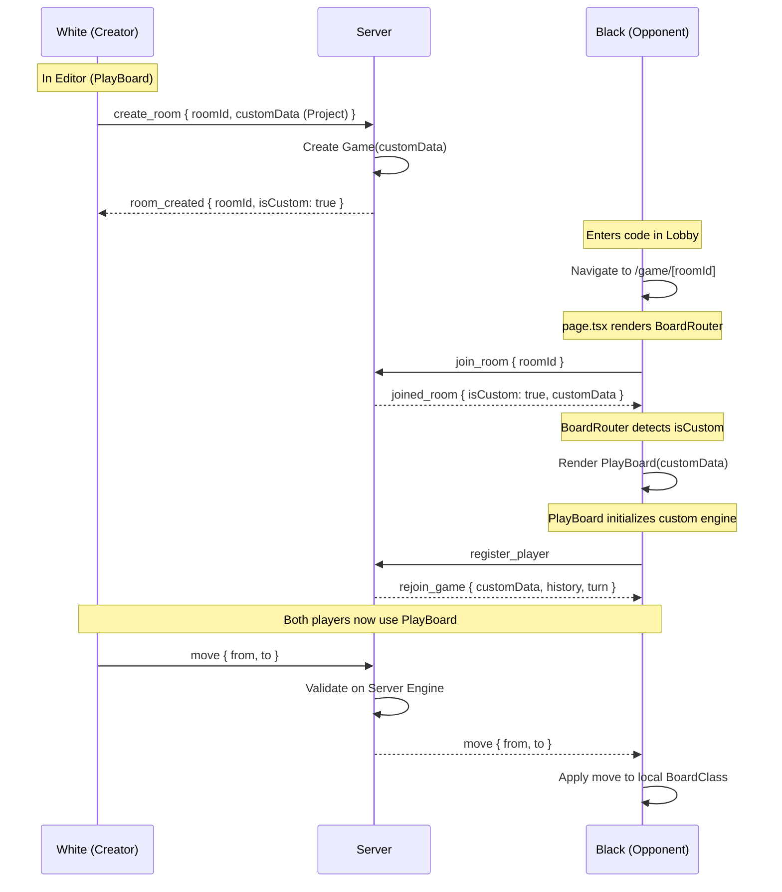

# Custom Board Flow - Play Against Friends

## Proposed Changes

### 1. Create `BoardRouter` Component

Create a wrapper that joins the room first, checks `isCustom`, and then mounts either `Board` or `PlayBoard`.

### 2. Update `game/[roomId]/page.tsx`

Replace the direct `Board` import with the new `BoardRouter`.

### 3. Refine `PlayBoard.tsx`

Ensure it can initialize correctly when _only_ `roomId` is provided (fetching data from the socket).

### 4. Server Fixes

Ensure `joined_room` and `rejoin_game` reliably pass `customData` and that the server-side engine is used for validation of custom moves.
